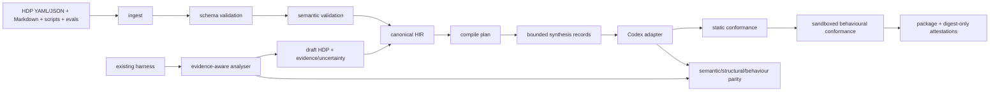

# AI Harness Factory architecture

Status: frozen for v0.1 vertical slice  
Date: 2026-08-12

## System boundary

The factory accepts a hybrid Harness Definition Package (HDP), normalizes it to
a target-neutral Harness Intermediate Representation (HIR), compiles it through
one target adapter, runs static and behavioural conformance, then packages the
result with evidence and digest-bound statements. The analyser traverses the
opposite direction by extracting evidence-qualified propositions from an
existing harness, constructing an honest draft HDP, recompiling it, and
comparing semantic, structural, and behavioural parity.

## HDP package

The authoring package combines:

- YAML or JSON facts validated with Draft 2020-12 JSON Schema;
- referenced Markdown role, workflow, evidence, and recovery modules;
- deterministic scripts for parsing, policy checks, test execution, and
  artifact validation;
- public fixtures and eval specifications, with hidden evaluators held outside
  the model/harness trust boundary;
- target bindings under a separate binding namespace; and
- evidence maps, content digests, release metadata, and statements.

The v0.1 implementation accepts one resolved canonical YAML/JSON document. A
package resolver may materialize that projection from modules, but includes and
overlays are not normative until merge and provenance rules are implemented.

## Target-neutral HIR

HIR v0.1 is an immutable, canonical projection containing these entity types:

| Entity | Meaning |
| --- | --- |
| Actor | role, objectives, responsibilities, delegation and stopping scope |
| TaskState | workflow state, entry/exit conditions and transitions |
| Capability | tool/operation, side effects and constraints |
| ContextSource | source, authority, freshness, classification and retention |
| Artifact | input/output/evidence object plus validation contract |
| Environment | runtime and filesystem/network/process boundary |
| Policy | deny/allow/approval/obligation with subject and resource selectors |
| EvaluatorGate | deterministic or assisted check, threshold and failure effect |
| EventMetric | event schema, trace fields, metric and redaction contract |
| AdapterRef | adapter identity/version and binding reference only |

Relations are explicit typed edges: actors perform states and may use
capabilities; states require capabilities, read context, consume/produce
artifacts, run in environments, and transition to states; policies govern
actors/capabilities/states/artifacts; evaluators check states/artifacts/events;
events observe actors/states/capabilities; adapters realize the HIR. A relation
cannot introduce target-specific semantics.

## Compiler

The pipeline stages are:

1. ingest and safe local reference resolution;
2. Draft 2020-12 structural validation;
3. deterministic semantic validation;
4. canonical HIR normalization;
5. target binding validation and compile planning;
6. optional bounded synthesis for declared prose slots;
7. deterministic target rendering;
8. static conformance and secret/capability checks;
9. externally sandboxed behavioural conformance;
10. deterministic packaging; and
11. manifest, source map, HarnessCard, evidence, and in-toto-shaped statement
    generation.

Timestamps and run evidence do not participate in deterministic artifact-set
digests. Models cannot create permissions, capabilities, policies, gates, or
release decisions. Each synthesized output has a request/inputs/template/model/
settings/output digest record and independent gate result.

## Semantic invariants

- IDs are package-global and references resolve to one compatible entity.
- Every reachable state has an actor and environment and reaches a bounded
  terminal/stopping outcome; unjustified unreachable states and unbounded cycles
  fail.
- Required capabilities are granted to the actor and allowed by environment and
  policy. Deny wins; approval-required never becomes an unconditional grant.
- Required artifact inputs have a producer or declared external source;
  required outputs have validators.
- Required gates cannot depend only on model judgement.
- Target bindings cannot weaken or alter canonical identity, permissions,
  policy, or evaluator meaning; unsupported material semantics fail closed.
- Secrets are references, never literal values.
- Unresolved required analyser unknowns or material conflicts block release.
- Every generated artifact maps to source JSON Pointers or an explicit synthesis
  record.
- Normalization is idempotent and canonical serialization is order-independent.

## Codex adapter

The first adapter emits compact `AGENTS.md`, `.agents/skills/<name>/SKILL.md`,
project-scoped `.codex/config.toml`, role/state/evidence artifacts,
deterministic scripts, eval assets, source map, and HarnessCard. MCP is present
at the target-binding interface but adapter v0.1 rejects populated MCP bindings
until exact capability, policy, network, and version semantics are implemented.
Codex file names, TOML keys, skill formatting, and MCP transport representation
never appear as canonical HIR fields.

The adapter validates the installed target surface where observable. It records
Codex version, requested/observed model and reasoning, feature set, sandbox and
approval policy, and MCP revision. Unsupported or machine-local settings fail
instead of producing inert configuration.

## Analyser and parity

Inventory covers controller code, instructions/prompts, config, skills, tools,
middleware, hooks, policies, tests, CI, and runtime defaults. Extractors emit
propositions with HDP pointer, value, `observed | declared | inferred | unknown`,
confidence, evidence references, extractor version, rationale, and conflict set.
Evidence includes repository-relative file and line/JSON-pointer/object location
plus content digest. Conflicts remain explicit; confidence cannot silently pick
a winner. Required unknowns remain absent/null in the evidence ledger and block
compilation when the schema cannot represent them honestly.

Round-trip comparison has three independent views:

- semantic: actors, capabilities, effective permissions, policies, states,
  transitions, artifacts and gates;
- structural: expected files, skills, config, hooks, and tool bindings; and
- behavioural: held-out tasks, events, policy-block outcomes, recovery, and
  external validators.

Permissions, denials, approvals, controlled-fixture relations, and material facts
require exact parity. Aggregate scores cannot mask a safety mismatch.

## Package and attestation

The deterministic release directory contains the harness, resolved HIR and
binding, manifest, source map, HarnessCard, conformance/test evidence, provenance,
and in-toto Statement-shaped build/test records. The manifest records SHA-256,
media type, and executable bit for every payload. Statements are unsigned and
labelled digest-only; no authenticity, SLSA level, ISO conformity, or
certification claim is made. `verify-release` recomputes the tree, checks subject
linkage, and rejects additions, deletions, content/mode/symlink changes, stale
subjects, and path traversal.

## Extension and version policy

HDP and HIR use independent semantic versions. Unknown major versions and
unknown required fields fail. Minor versions may add optional fields only where
declared adapter support exists. Extensions use namespaced `x-` keys and cannot
override or weaken core semantics. Adapters publish supported HDP/HIR ranges and
feature capabilities. Migrations are deterministic, explicit, and
provenance-recorded.
