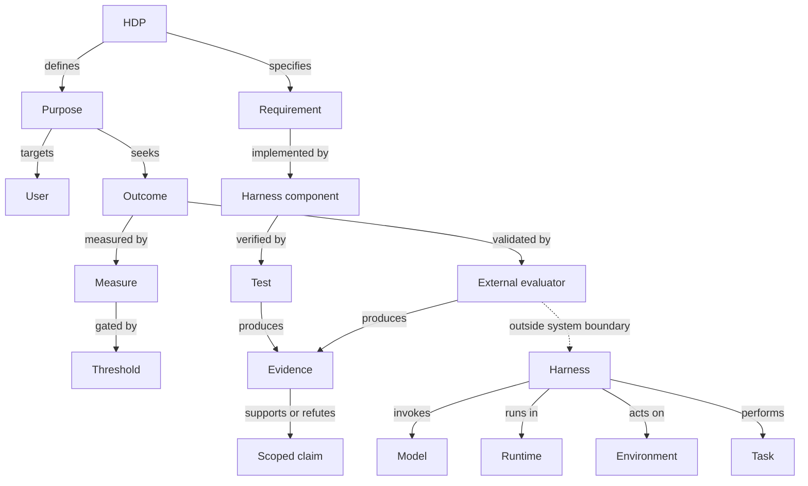

# Harness Definition Package 0.1 working specification

Status: reference specification, not an external standard  
Version: 0.1.0  
Schema dialect: JSON Schema Draft 2020-12

Normative terms **MUST**, **MUST NOT**, **SHOULD**, **SHOULD NOT**, and **MAY**
have their usual requirements meaning. They apply to this reference
specification only.

## Definitions and boundaries

An **AI harness** is the governed executable system around one or more models
that turns a task invocation into controlled actions and artefacts. It includes
resolved instructions, context assembly, model/provider adapters, tools,
orchestration/delegation, state, authorization, resource controls, failure
handling, telemetry, and evidence capture. A model or prompt alone is not a
harness.

A **Harness Definition Package (HDP)** is a versioned, declarative,
content-addressable information package that specifies intended users,
outcomes, operating conditions, requirements, harness-generation contracts,
execution controls, independent evaluation, and traceability/evidence. An HDP
is not a harness, runtime, evaluation result, or certificate.

| Element | Responsibility | Excluded responsibility |
| --- | --- | --- |
| Model | Inference over supplied input | Authorization, orchestration, independent acceptance |
| Harness | Context, control, tools, state, policy, artefacts | Final independent outcome judgment |
| Runtime | Load and enforce process/filesystem/network/resource boundaries | Decide business fitness |
| Environment | External people, services, data, policy, and state | Harness-owned working state |
| Task | Adjudicable inputs, preconditions, required effects, and constraints | A preferred solution implementation |
| Evaluator | Judge permitted observations against declared measures | Operate as a harness role or leak hidden answers |
| Evidence | Integrity- and provenance-bearing observation or result | Any arbitrary log or self-assertion |

The evaluator MUST be outside the model-harness-runtime system under evaluation.
Its hidden fixtures, answer keys, scoring implementation, judge prompts, and
secrets MUST NOT be available to the generator, generated harness, model, tool
registry, context retrieval, or execution logs.

## Assurance vocabulary

- **Generation** transforms an HDP and target profile into harness artefacts and
  a derivation manifest. It proves derivation, not correctness.
- **Verification** checks that an artefact, implementation, configuration, or
  control satisfies specified requirements.
- **Validation** checks that the realised system is suitable for intended users,
  outcomes, and operating conditions.
- **Structural validation** checks the serialized definition against the
  canonical Draft 2020-12 schema.
- **Semantic verification** checks cross-field invariants, references,
  permissions, boundedness, evaluation independence, and trace coverage that
  JSON Schema cannot express.
- **Conformance** means every mandatory obligation for a named HDP version,
  profile, capability set, and pinned subject is satisfied.
- **Fitness for outcome** means evidence supports suitability for one named
  purpose and operating envelope. Conformance alone is insufficient.
- **Operational assurance** is a time-bounded claim that a pinned harness remains
  conformant and acceptably fit, supported by runtime, monitoring, change,
  incident, drift, and evaluation evidence.

No layer may silently turn `unknown`, `not-run`, `not-applicable`,
`inconclusive`, or `blocked` into `pass`.

## Ontology



The detailed class/relation vocabulary is
[`ontology.yaml`](../workstreams/schema-design/ontology.yaml); the full
conceptual analysis is
[`conceptual-model.md`](../workstreams/schema-design/conceptual-model.md).

## Package architecture

Version 0.1 has one canonical resolved YAML or JSON definition. The surrounding
package separates independently governed artefacts:

```text
hdp-package/
├── hdp.yaml                    # canonical resolved definition
├── schemas/                    # HDP and task/artifact schemas
├── profiles/                   # versioned target/conformance bindings
├── public-fixtures/            # model-visible test inputs only
├── generated/                  # disposable derived harness
├── evaluator/                  # separately permissioned, never generator input
├── evidence/                   # run/evaluation evidence outside generated tree
└── decisions/                  # design and change records
```

Large authoring packages MAY maintain purpose, operations, requirements,
models, tools, orchestration, governance, evaluation, and other modules, but
MUST resolve them deterministically to the canonical object before validation or
generation. Version 0.1 deliberately does not define arbitrary includes or
overlay merge semantics. See
[`information-architecture.md`](../workstreams/schema-design/information-architecture.md)
for the module design and complete field-family mapping.

## Validation layers

1. Safe transport: bounded input, safe YAML types, duplicate-key rejection.
2. Structural: Draft 2020-12 schema and format assertions.
3. Referential: globally unique stable IDs and typed references.
4. Semantic: cross-field invariants and contradictions.
5. Profile: cumulative obligations for the selected conformance profile.
6. Implementation: generated artefact/source-map and runtime-control checks.
7. Outcome: independent evaluator against representative scenarios.
8. Operational assurance: pinned subject plus monitoring and invalidation.

The implementation currently enforces 31 cross-field rule families. The
expanded design catalogue contains 62 proposed rules in
[`semantic-rules.yaml`](../workstreams/schema-design/semantic-rules.yaml). Rules
not implemented in 0.1 MUST NOT be implied by a validation pass.

## Profiles

Profiles are cumulative obligation sets:

- `core`: identity, purpose, outcomes, requirements, bounds, evaluation intent,
  and traceability.
- `development`: core plus generation, public fixtures, regression, and basic
  telemetry.
- `controlled`: development plus deny-by-default permissions, evaluator
  isolation, data classification, negative/adversarial tests, and retained
  evidence.
- `production`: controlled plus deployment pinning, rollback, monitoring,
  incidents, drift, and change invalidation.
- `high-assurance`: production plus independent operation, stronger custody and
  attestation, separation of duties, and formal risk acceptance.

The Codex adapter supports the target-neutral `software-development` profile
with a controlled example. The profile name is not itself evidence that every
production or high-assurance obligation has been demonstrated.

## Traceability

Traceability is a typed graph. Each intended outcome MUST reach a requirement,
component, test, and evidence node. Each mandatory requirement MUST reach a
verification test and expected evidence. Evidence MAY support or refute claims;
its mere existence is not a pass.

The minimum reference path is:

```text
outcome -> requirement -> component -> test -> evidence
```

## Versioning and extensions

- `hdpVersion` selects this vocabulary; unknown major versions MUST fail.
- Package definitions use semantic versioning. Removing/reinterpreting a
  required field, invariant, permission, evaluator boundary, or profile
  obligation is breaking.
- Core objects reject unknown fields. Extensions MUST live under `extensions`
  with a reverse-domain-like `x-` key.
- An extension MUST NOT weaken, override, or reinterpret core requirements.
- Generators MUST preserve unknown optional extensions and MUST reject unknown
  required extension semantics.
- Generated artefacts MUST record HDP identity/version/digest, generator
  identity/version, artefact digests, and source JSON Pointers.
- Mutable model/provider aliases MUST be recorded as mutable and resolved at run
  time; they cannot support a fully reproducible subject claim alone.

## Standards position

HDP is an original integration layer; it is not a replacement for every
interface standard and makes no formal ISO/NIST/OMG conformity claim.

| Source | Classification | HDP use | Material omission addressed by HDP |
| --- | --- | --- | --- |
| JSON Schema Draft 2020-12 | Mature open specification | Normative structure | Runtime meaning, authorization, outcomes, evidence |
| ISO/IEC/IEEE 29148:2018 | Formal standard | Requirements quality/traceability concepts | Agent runtime and evaluator custody |
| OMG SACM 2.3 | Formal standard | Claim-argument-evidence concepts | Executable harness generation and task operation |
| NIST AI RMF 1.0 / AI 600-1 / TEVV | Government framework/guidance | Risk, measurement, TEVV | Concrete portable harness schema |
| Oracle Agent Spec language 26.1.0 / PyAgentSpec 26.1.2 | Emerging specification/SDK | Optional portable agent/flow adapter | Purpose, governance, independent assurance |
| Agent Skills living specification | Emerging portable format | Analysis-skill distribution | Machine enforcement and outcome proof |
| MCP 2026-07-28 | Emerging protocol | Tool/context binding | Authorization, lifecycle, outcome fitness |
| A2A protocol 1.0 | Emerging protocol | External-agent interface | Internal harness governance and evidence |
| OpenAPI 3.2.0 | Stable industry specification | HTTP interface contracts | Harness semantics and independent evaluation |
| OASF 1.1.0 | Emerging schema framework | Optional discovery export | Verified capability and operational assurance |
| Natural-Language Agent Harnesses and harness-engineering papers | Research frameworks | Roles/stages/adapters/state/failure hypotheses | Normative interoperable contract |

Primary-source details, versions, URLs, gaps, and uncertainties are preserved in
[`standards-research.md`](../workstreams/standards/standards-research.md) and
[`sources.json`](../workstreams/standards/sources.json).

## Decisions and unresolved questions

Accepted decisions include a resolved canonical document inside a governed
package; external evaluator custody; protocol-neutral canonical semantics;
deterministic release authority; evidence propositions before reconstruction;
fail-closed adapters; local digest-only prototype statements; and the command
recorder explicitly not being treated as an OS sandbox. See [`decisions/`](decisions/)
and the extended [`decisions.md`](../workstreams/schema-design/decisions.md).

Open questions include future module overlay semantics, a stable unknown-value
representation, optional SACM export, Agent Spec 26.2 adoption timing, LLM-judge
pass policy, capability-evidence grades for OASF/A2A, clause-level 29148 mapping,
and the minimum portable OS isolation contract.
